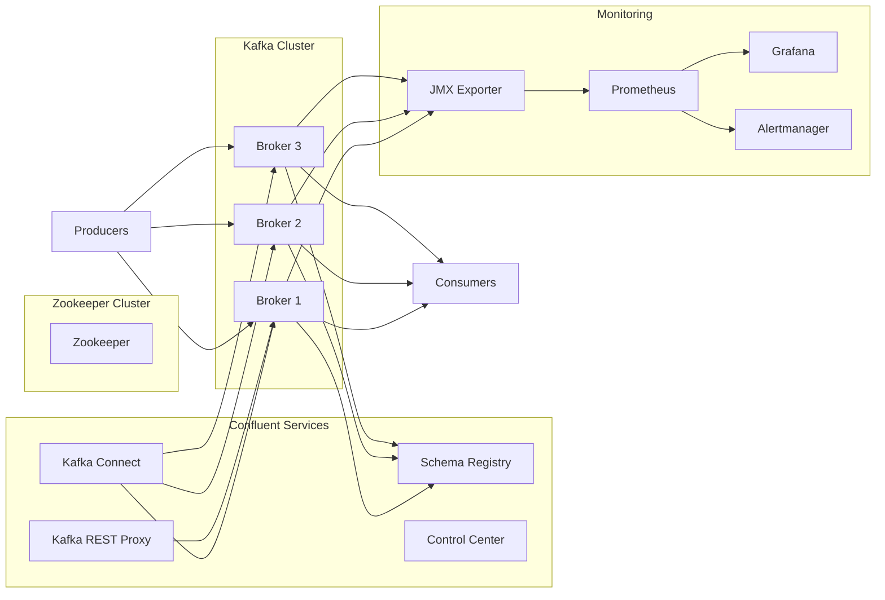

# 📊 Kafka Confluent Labs


---

## 🚀 Overview

Ce repository propose une plateforme complète **Apache Kafka basée sur Confluent Platform** déployée avec **Docker Compose**.
 
Il est conçu pour apprendre à installer, configurer, monitorer et administrer un cluster Kafka dans un contexte proche de la production.


💡 Objectif : 

- Comprendre l’architecture de Kafka (brokers, partitions, replication…)
- Installer et configurer un cluster Kafka
- Administrer les topics, producers et consumers
- Mettre en place du monitoring (Prometheus, Grafana…)
- Gérer les opérations courantes (rebalance, scaling, troubleshooting)
- Appliquer les bonnes pratiques d’exploitation

passer de **0 à Kafka Admin opérationnel**

---

## ⚙️ Prérequis

* Linux / MacOS
* Docker (recommandé)
* JDK 11+ installé (JDK 17+ recommandé pour Kafka 4.0)
* Droits administrateur

Choix de version :

* Kafka 3.9 : Compatible avec Java 11+ (recommandé pour la compatibilité)
* Kafka 4.0 : Nécessite obligatoirement Java 17+

Connaissances utiles :

* Linux
* Réseau
* Concepts Kafka

---

## 📦 Contenu

👉 Fichier principal :

`Kafka-labs-admin.md`

### 🔹 Labs inclus :

#### 1. Setup

* Installation Java & Kafka
* Configuration Linux

#### 2. Cluster Kafka

* Setup multi-brokers
* Configuration ZooKeeper

#### 3. Operations

* Création de topics
* Production / consommation

#### 4. Administration avancée

* Consumer Groups
* Rebalancing
* Replication

#### 5. Monitoring

* JMX Exporter
* Prometheus
* Grafana dashboards
* Alertmanager

#### 6. Scénarios réels

* Simulation de panne
* Scaling
* Troubleshooting

---

## 🧱 Architecture Confluent (Docker Compose)

### 🔷 Diagramme (Mermaid)



---

### 🖼️ Architecture (Confluent Platform)


---

## 📦 Stack déployée

Cette architecture repose sur les images **Confluent Platform** et inclut :

### 🔹 Core Kafka

* Zookeeper
* Kafka Brokers (multi-nodes)

### 🔹 Confluent Services

* Schema Registry
* Kafka Connect
* Kafka REST Proxy
* Control Center

👉 Ces composants sont fournis nativement dans les images Confluent et configurés via variables d’environnement dans Docker Compose ([Confluent][1])

---

### 🔹 Monitoring Stack

* JMX Exporter
* Prometheus
* Grafana
* Alertmanager

💡 Les métriques Kafka sont exposées via JMX puis collectées par Prometheus ([Confluent][1])

---

## ⚙️ Fonctionnement

Le fichier `docker-compose.yml` permet de :

* Définir tous les services Kafka
* Configurer les variables d’environnement (listeners, replication…)
* Exposer les ports
* Gérer les dépendances entre services

👉 Docker Compose permet de lancer toute la plateforme avec une seule commande et garantit un environnement reproductible ([DataCamp][2])

---

## 🚀 Quick Start

```bash
git clone https://github.com/hisi91/cp-all-in-one.git
cd cp-all-in-one/cp-all-in-one-metrics

docker compose up -d
```

Vérifier les containers :

```bash
docker compose ps
```

Arrêter :

```bash
docker compose down -v
```

---

## 🌐 Accès aux services

| Service         | URL                                            |
| --------------- | ---------------------------------------------- |
| Kafka Broker    | localhost:9092                                 |
| Schema Registry | [http://localhost:8081](http://localhost:8081) |
| Kafka Connect   | [http://localhost:8083](http://localhost:8083) |
| REST Proxy      | [http://localhost:8082](http://localhost:8082) |
| Control Center  | [http://localhost:9021](http://localhost:9021) |
| Prometheus      | [http://localhost:9090](http://localhost:9090) |
| Grafana         | [http://localhost:3000](http://localhost:3000) |

---

## 📊 Monitoring Kafka

### 🔹 Métriques disponibles

* Kafka Broker metrics (JMX)
* Consumer lag
* Throughput
* Partition distribution
* Request latency

### 🔹 Stack

| Tool         | Rôle                 |
| ------------ | -------------------- |
| Prometheus   | Collecte             |
| Grafana      | Visualisation        |
| Alertmanager | Alerting             |
| JMX Exporter | Exposition métriques |

---

## 🧪 Cas d’usage

* Administration Kafka (topics, partitions, replication)
* Monitoring temps réel
* Debugging (lag, ISR, leaders)
* Test de résilience (broker down)
* Scaling cluster

---

# 📊 Kafka Confluent Labs - Administration

## coming soon ...


---

## 📄 Licence

MIT License

---

## 👨‍💻 Auteur

Yassine SIHI

---

## ⭐ Support

Si ce projet t’aide :

* ⭐ Star le repo
* 🔁 Partage
* 💬 Contribue
