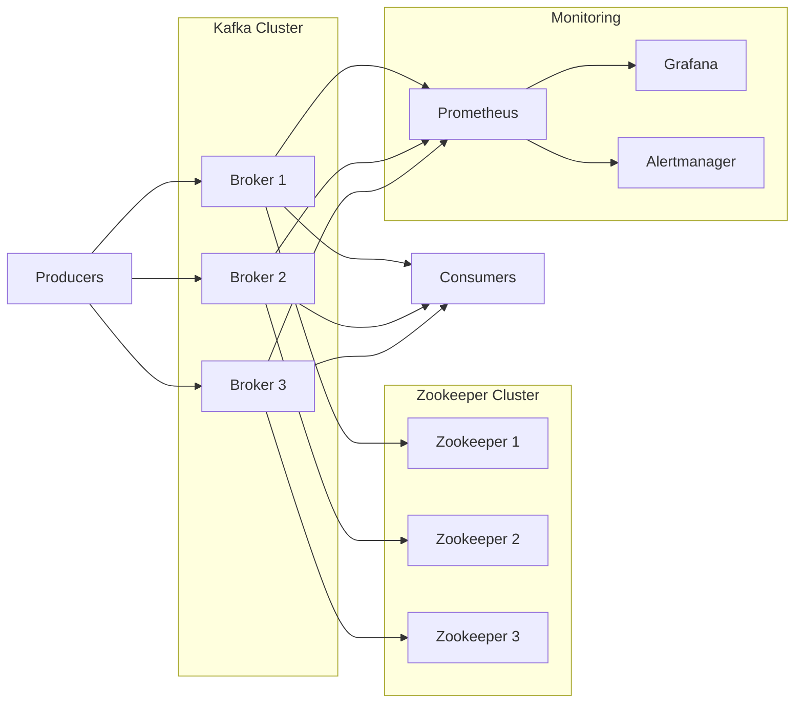

# 📊 Kafka Confluent Labs - Administration

Ce repository contient une série de labs pratiques autour de l’administration de Apache Kafka.  
Il est conçu pour apprendre à installer, configurer, monitorer et administrer un cluster Kafka dans un contexte proche de la production.


## 🧱 Architecture du Lab

Le lab repose généralement sur une architecture de base sur de docker compose:

- 3 brokers Kafka
- 3 nœuds ZooKeeper
- 1 node utilitaire (monitoring & outils)

Stack de monitoring :

- Prometheus
- Grafana
- Alertmanager
- JMX Exporter

---

# 📊 Kafka Labs - Administration


---

## 🚀 Overview

Ce repository propose une série de **labs pratiques pour maîtriser l’administration de Apache Kafka** dans un environnement proche de la production.

👉 Objectif : passer de **0 à Kafka Admin opérationnel**

---

## 🧱 Architecture Kafka (Lab)

### 🔷 Diagramme (Mermaid)



---

### 🖼️ Diagramme (Image fallback)


---

## 🎯 Objectifs

Ces labs ont pour but de te permettre de :

- Comprendre l’architecture de Kafka (brokers, partitions, replication…)
- Installer et configurer un cluster Kafka
- Administrer les topics, producers et consumers
- Mettre en place du monitoring (Prometheus, Grafana…)
- Gérer les opérations courantes (rebalance, scaling, troubleshooting)
- Appliquer les bonnes pratiques d’exploitation

---

## 📦 Contenu

👉 Fichier principal :

`Kafka-labs-admin.md`

### 🔹 Labs inclus :

#### 1. Setup

* Installation Java & Kafka
* Configuration Linux

#### 2. Cluster Kafka

* Setup multi-brokers
* Configuration ZooKeeper

#### 3. Operations

* Création de topics
* Production / consommation

#### 4. Administration avancée

* Consumer Groups
* Rebalancing
* Replication

#### 5. Monitoring

* JMX Exporter
* Prometheus
* Grafana dashboards
* Alertmanager

#### 6. Scénarios réels

* Simulation de panne
* Scaling
* Troubleshooting

---

## ⚙️ Prérequis

* Linux / MacOS
* Java (JDK 8+)
* Docker (recommandé)

Connaissances utiles :

* Linux
* Réseau
* Concepts Kafka

---

## 🚀 Quick Start

```bash
git clone https://github.com/hisi91/KAFKA-LABS.git
cd KAFKA-LABS
cat Kafka-labs-admin.md
```

---

## 📊 Monitoring Stack

| Tool         | Rôle                       |
| ------------ | -------------------------- |
| Prometheus   | Collecte des métriques     |
| Grafana      | Visualisation              |
| Alertmanager | Alerting                   |
| JMX Exporter | Exposition métriques Kafka |

---

## 🧪 Cas d’usage

* Haute disponibilité Kafka
* Réplication des partitions
* Debugging cluster
* Monitoring production
* Optimisation performance

---

## 🤝 Contribution

Les contributions sont les bienvenues :

* Nouveaux labs
* Dashboards Grafana
* Scripts d’automatisation
* Fix & amélioration

```bash
# Workflow
Fork → Branch → Commit → Pull Request
```

# 📊 Kafka Confluent Labs - Administration

## coming soon ...


---

## ⭐ Support

Si ce repo t’aide :

👉 Mets une ⭐ sur GitHub
👉 Partage avec d’autres devs

---

## 👨‍💻 Auteur

**Yassine SIHI**
